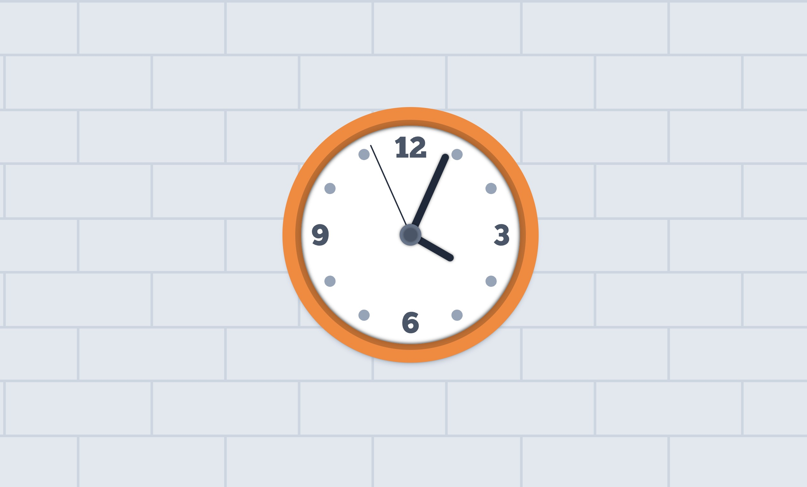

# 02 - JS and CSS Clock

> DISCLAIMER: I probably spent a lot more than I should have just making it look pretty 😅. [You can view the CodePen here](https://codepen.io/snrankin/pen/wvOoqKV)

## PRE-VIDEO

I decided to start with the actual rotation of the hands before worrying about the ticking animation. The thing that took me the most time was trying to figure out how to match the different timing intervals to the rotation degree.
Geometry was never my strong suit... but eventually I was able to figure it out and get the hands rotating the proper amount at the proper time.

Some things I did differently:

- Made the clock responsive, because why not.
- Adjusted the initial styling of the hands so that they were already pointing to 12 instead of having them initially pointing to 9 and then using CSS to rotate them to 12. It just made it easier for me to figure out the JavaScript.
- Added some extra html elements purely for styling purposes.
- **Added more logic so that it would calculate the _remaining_ time until the next second/minute/hour before it starts the interval.**
    - So if a page was loaded at 11:58:30, it would wait 30 seconds before launching the minute interval, and 2 minutes and 30 seconds before launching the hour interval. So at 12am/pm it would move all three hands to the 12.

## POST-VDEO

The only thing I had trouble with was the ticking animation, which I added to the final code. I also added a class
called `.has-transition` that is added to every hand until they move to the 12 o'clock position at which point the class is removed so that it doesn't do that reversal thing like in the video. Then on their next movement, the class is re-added to give the hands that transition.
